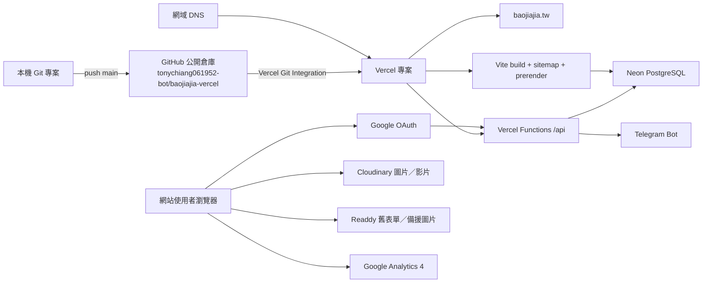

# 保家佳網站：系統現況、帳號關聯與部署手冊

> 最後核對日期：2026-09-02（Asia/Taipei）  
> 本文件用途：讓網站擁有者、Claude、Codex 或後續開發者快速掌握目前正式網站的技術架構、部署方式、帳號關聯、資料流與已知風險。  
> 安全原則：本文件只記錄公開識別資料與環境變數名稱，不記錄密碼、Token、私鑰或資料庫連線字串。

## 1. 現況摘要

| 項目 | 目前狀態 |
|---|---|
| 品牌 | 保家佳 |
| 正式網站 | [https://baojiajia.tw](https://baojiajia.tw) |
| 標準網域 | `https://baojiajia.tw`（不含 `www`） |
| Vercel 預設網址 | [https://baojiajia-insurance.vercel.app](https://baojiajia-insurance.vercel.app) |
| 新 GitHub 倉庫 | [tonychiang061952-bot/baojiajia-vercel](https://github.com/tonychiang061952-bot/baojiajia-vercel) |
| 倉庫可見性 | Public（公開） |
| 正式分支 | `main` |
| Git remote | `origin` → `https://github.com/tonychiang061952-bot/baojiajia-vercel.git` |
| 目前電腦本機路徑 | `/Users/chianghaoen/Desktop/SEO/baojiajia_insurance-main` |
| 前端 | React 19、TypeScript、Vite 7、Tailwind CSS |
| Hosting／Functions | Vercel、Vercel Functions（`/api`） |
| 正式資料庫 | Neon PostgreSQL |
| 登入 | Google Identity Services／Google OAuth ID Token |
| 媒體上傳 | Cloudinary；另有部分 Readdy 舊圖片來源 |
| 系統通知 | Telegram Bot |
| 流量分析 | Google Analytics 4：`G-5CP17W4XQV` |
| SEO 輸出 | Build 時產生 sitemap 並預渲染公開頁面 |

目前正式站健康檢查顯示：Vercel Functions 可執行、必要環境變數已存在、Neon 資料庫可連線。健康檢查網址為 `https://baojiajia.tw/api/health`。

## 2. 新倉庫與作者資訊

### 新倉庫

- GitHub 擁有者帳號：`tonychiang061952-bot`
- Repository：`baojiajia-vercel`
- 完整網址：`https://github.com/tonychiang061952-bot/baojiajia-vercel`
- Clone URL：`https://github.com/tonychiang061952-bot/baojiajia-vercel.git`
- 預設／正式部署分支：`main`
- 目前沒有 `.github/workflows`，部署不是透過 GitHub Actions。
- 目前沒有提交 `.vercel/` 專案中繼資料；Vercel team、project ID 無法只靠本倉庫確認。
- 舊 GitHub 倉庫網址沒有保留在目前的 Git remote 或專案設定中，不能從現有資料可靠推定。

### Git 提交作者

建立本文件前的 13 筆 commit 使用同一組作者與提交者資料：

- Git author／committer name：`tonychiang061952-0610`
- Git author／committer email：`tonychiang061952@gmail.com`
- GitHub repository owner handle：`tonychiang061952-bot`

Git 作者名稱與 GitHub 帳號 handle 不相同是正常的；commit 是以 Email 與 GitHub 帳號進行歸屬。GitHub 登入帳號的實際 Email 無法由公開倉庫直接驗證。

查詢目前設定：

```bash
git config --get user.name
git config --get user.email
git remote -v
git branch -vv
```

### 網站文章作者

- 目前有有效 slug、啟用且公開的文章，作者欄位使用「保家佳」。
- Article 結構化資料將作者輸出為 `Organization`，作者連結指向 `/about`。
- 資料庫另有一筆作者為 `Angel`、無 slug、`is_active=false` 的舊文章紀錄；它不會進入目前 sitemap 與正式預渲染文章清單。
- 網站目前沒有公開的個人作者／審閱者頁，屬品牌作者模式。

## 3. 帳號與服務之間的關聯



### 帳號／識別資料對照表

| 系統 | 已確認的識別資料 | 與網站的關聯 | 尚待網站擁有者補充 |
|---|---|---|---|
| GitHub | `tonychiang061952-bot/baojiajia-vercel` | 程式碼來源；`main` 觸發正式部署 | GitHub 登入 Email、備援管理員、2FA／Recovery 管理方式 |
| Git commit | `tonychiang061952-0610`／`tonychiang061952@gmail.com` | 所有現有 commit 的作者與提交者 | 是否要長期沿用這組 author identity |
| Google 管理員 | `tonychiang061952@gmail.com` | 已在 Neon `admin_users` 確認；也是 `.env.example` 的 `ADMIN_EMAILS` | Google Cloud 專案名稱、project ID、OAuth client 名稱與備援擁有者 |
| Vercel | 專案對外網址為 `baojiajia-insurance.vercel.app` | GitHub `main` push 後自動 build／deploy；承載網站與 `/api` | Vercel 登入 Email、team 名稱、project ID、Git integration 擁有者 |
| Neon | 透過 `DATABASE_URL` 使用 | 正式內容、管理員名單、會員資料、設定與 rate limit | Neon 登入 Email、project ID、branch、region、備份／還原負責人 |
| Cloudinary | cloud name：`dkmqvyso4`；unsigned preset：`baojiajia_upload` | 後台圖片與影片上傳 | Cloudinary 登入 Email、preset 限制、容量／帳單負責人 |
| Telegram | Bot Token 與 Chat ID 存在 Neon `system_settings` | 問卷、下載、聯絡與評價通知 | Bot username、Telegram 擁有者、目標群組／chat 名稱 |
| Readdy | 兩個表單 ID 與多個圖片網址仍存在程式中 | 舊表單接收與圖片備援；頁尾品牌標籤已移除 | Readdy 登入帳號、表單資料接收位置、是否要完整移除依賴 |
| GA4 | Measurement ID：`G-5CP17W4XQV` | 前端流量追蹤 | Google Analytics property 名稱、管理員與資料保存設定 |
| DNS／網域 | `baojiajia.tw`、`www.baojiajia.tw` | DNS 指向 Vercel；`www` 永久轉址至 apex | 網域註冊商、DNS 帳號 Email、續約方式與備援管理員 |
| Search Console／Bing | 程式含 sitemap、robots、`BingSiteAuth.xml` | 搜尋引擎驗證與收錄 | Search Console／Bing Webmaster Tools 的實際擁有者帳號 |

### Email 的三種不同角色

請勿把以下 Email 混為一談：

1. `tonychiang061952@gmail.com`
   - Git commit author／committer Email。
   - `.env.example` 目前列出的管理員 Email。
   - 2026-09-02 已用唯讀查詢確認它是 Neon `admin_users` 中唯一的管理員 Email。
   - 可透過 Google 登入並被判定為 admin。

2. `info@insurance.com`
   - 目前 Neon `contact_info` 中啟用的網站聯絡 Email。
   - 這看起來是範例資料，不應直接視為保家佳正式客服信箱；正式公開前應由網站擁有者確認或更換。

3. 使用者 Email
   - 需求分析使用者透過 Google 登入取得已驗證 Email。
   - Email 會與問卷／下載紀錄一起寫入 Neon，並可能出現在 Telegram 通知中。

目前 `contact_info` 中的地址 `台北市信義區信義路五段7號` 與電話 `+886-2-1234-5678` 也疑似範例資料，應和 `info@insurance.com` 一併確認。

## 4. 正式部署方式

### 部署主流程

1. 在本機專案修改程式。
2. 執行 `npm run build`。
3. Build 依序執行：
   - `tsc -p tsconfig.api.json`：檢查 Vercel API TypeScript。
   - `node scripts/generate-sitemap.mjs`：從 Neon 讀取文章／服務資料並更新 `public/sitemap.xml`。
   - `vite build`：產生前端檔案至 `out/`。
   - `node scripts/prerender.mjs`：從 Neon 讀取正式內容，為公開路由產生含正文與 SEO meta 的 HTML。
4. 只 stage 本次要提交的檔案，commit 後 push 至 `origin/main`。
5. Vercel Git Integration 偵測 `main` 更新，自動執行 `npm run build`。
6. Vercel 發布 `out/`，並把 `api/**/*.ts` 部署為 Vercel Functions。
7. Vercel 將 deployment 綁定到 `baojiajia.tw`；`www.baojiajia.tw` 永久轉址到不含 `www` 的正式網址。

常用指令：

```bash
npm ci
npm run build
git status --short
git diff --check
git add <本次修改的檔案>
git commit -m "描述本次修改"
git push origin main
```

### `vercel.json` 的重要設定

```json
{
  "buildCommand": "npm run build",
  "outputDirectory": "out",
  "framework": "vite",
  "cleanUrls": true,
  "trailingSlash": false
}
```

另外有一條 permanent redirect：若 Host 是 `www.baojiajia.tw`，轉到 `https://baojiajia.tw/$1`。

### DNS 現況

2026-09-02 查詢結果：

- Apex `baojiajia.tw` 目前 A record 回應 `216.198.79.1`。
- `www.baojiajia.tw` CNAME 指向 `5f18eb3bb71a1669.vercel-dns-017.com`。
- 正式網站 HTTP response header 為 `server: Vercel`。

Vercel 的 DNS 目標可能更換；日後設定時應以 Vercel Domains 畫面顯示的值為準，不要只複製本文件的歷史 IP／CNAME。

### 部署特性與注意事項

- 沒有 GitHub Actions；目前完全依賴 Vercel Git Integration。
- README 或純文件 commit 也可能觸發一次 Vercel deployment。
- Build 時 `prerender.mjs` 強制需要 `DATABASE_URL`；Neon 無法連線時，正式 build 會失敗。
- `generate-sitemap.mjs` 在沒有資料庫時可退回靜態 sitemap，但後續 prerender 仍會因缺少資料庫而停止。
- 專案未在 `package.json` 固定 Node `engines`。核對當下本機為 Node `v24.19.0`，正式 Vercel Function health 顯示 Node `v24.18.0`。
- 目前 build 有兩項非阻擋警告：Browserslist 資料較舊、PDF vendor chunk 大於 600 kB。

## 5. 環境變數

### 正式環境必要變數

| 變數 | 用途 | 是否可公開值 |
|---|---|---|
| `DATABASE_URL` | Neon pooled PostgreSQL 連線；API、sitemap、prerender 使用 | 否 |
| `SESSION_SECRET` | 簽署 `baojiajia_session` JWT cookie | 否 |
| `GOOGLE_CLIENT_ID` | Google Identity Services client ID；會被注入前端 | Client ID 可公開，但仍由環境管理 |
| `GOOGLE_CLIENT_SECRET` | 目前 health endpoint 將其列為必要環境變數 | 否 |

注意：目前 `api/auth/google.ts` 驗證 ID Token 時實際使用 `GOOGLE_CLIENT_ID`，沒有讀取 `GOOGLE_CLIENT_SECRET`；但 `api/health.ts` 仍要求 secret 存在。若未來整理，需同步評估 health check 與 Google OAuth 設定後再移除。

### 管理與遷移用變數

| 變數 | 用途 |
|---|---|
| `ADMIN_EMAILS` | 逗號分隔的管理員 Email；`npm run seed:admins` 寫入 Neon `admin_users` |
| `DATABASE_URL_UNPOOLED`、`PG*`、`POSTGRES_*` | Neon／Vercel 整合可能自動提供的其他連線形式；目前主要程式使用 `DATABASE_URL` |
| `SUPABASE_URL` | 只供舊 Supabase → Neon 遷移腳本使用 |
| `SUPABASE_PUBLISHABLE_KEY` | 只供舊 Supabase → Neon 遷移腳本使用 |

### Vite／舊平台相容變數

| 變數 | 用途 |
|---|---|
| `BASE_PATH` | Vite／React Router basename，預設 `/` |
| `IS_PREVIEW` | Preview 模式旗標 |
| `PROJECT_ID` | 注入 `__READDY_PROJECT_ID__`，屬舊平台相容欄位 |
| `VERSION_ID` | 注入 `__READDY_VERSION_ID__`，屬舊平台相容欄位 |

本機目前有被 `.gitignore` 排除的 `.env` 與 `.env.local`。不得把內容貼入 README、issue、對話或 commit。`.env.example` 只保留變數名稱與無敏感性的示例。

## 6. 應用程式架構

### 前端路由

| 路由 | 用途 |
|---|---|
| `/` | 首頁 |
| `/services` | 服務項目總覽 |
| `/services/:slug` | 服務內容頁 |
| `/blog` | 知識專區 |
| `/blog/:slug` | 文章正式網址 |
| `/blog/id/:id` | 舊 ID 網址相容路由 |
| `/beginner` | 保險新手村 |
| `/analysis` | 需求分析 DIY 與 PDF 報告 |
| `/about` | 關於我們 |
| `/contact` | 聯絡表單 |
| `/privacy` | 隱私政策 |
| `/terms` | 服務條款 |
| `/admin/login` | Google 後台登入，`noindex` |
| `/admin` | 需要 admin 身分的管理後台 |
| `*` | 404 頁面 |

### 後端 API

| API | 方法 | 用途 |
|---|---|---|
| `/api/database` | `POST` | 前端 Supabase-like query builder 的統一 Neon CRUD API |
| `/api/auth/google` | `GET`／`POST`／`DELETE` | 讀取 session、Google 登入、登出 |
| `/api/contact-submissions` | `POST` | 寫入聯絡表單至 Neon，並嘗試發 Telegram 通知 |
| `/api/downloads/claim` | `POST` | 驗證登入者 PDF 下載額度並原子累加次數 |
| `/api/notifications/telegram` | `POST` | 登入後送出允許類型的 Telegram 通知 |
| `/api/health` | `GET` | 回報環境變數是否存在、Node runtime 與 Neon 連線狀態 |

### Neon 資料層

主要 schema：

- `app_records`：以 `collection + JSONB data` 儲存大部分 CMS／會員資料。
- `admin_users`：後台授權 Email。
- `request_rate_limits`：聯絡表單與通知 API rate limit。
- `schema_migrations`：Neon migration 紀錄。

資料 migration 位於：

- `db/migrations/001_neon_schema.sql`
- `db/migrations/002_security_and_constraints.sql`

目前前端仍大量使用這種寫法：

```ts
import { db as supabase } from '.../lib/database';
```

這只是為了降低舊程式改動量的變數別名。實際執行時不再直接呼叫 Supabase，而是呼叫 `/api/database`，再由 Vercel Function 連線 Neon。

### 權限模型

- Google 驗證成功的任何帳號可成為 `member`。
- Email 存在 Neon `admin_users` 才會成為 `admin`。
- `/admin` 前端路由只允許 `admin`。
- API 仍會在伺服器端再次檢查 session／role，不能只依賴前端保護。
- Session cookie 名稱：`baojiajia_session`。
- Session 使用 HS256 JWT、HttpOnly、SameSite=Lax、有效期 7 天；production 會加 `Secure`。
- 公開內容 collection 可匿名讀取；寫入與敏感 collection 依 member／admin 權限限制。

## 7. 內容、表單、圖片與通知資料流

### CMS 內容

後台透過 `/api/database` 編輯 Neon。首頁、服務、文章、關於我們、評價、PDF 模板與系統設定都存於 Neon `app_records`。

### 需求分析 DIY

1. 問卷進度暫存在瀏覽器 `localStorage`：`analysis_step`、`analysis_data`。
2. 使用者必須以 Google 登入，才能取得與下載 PDF 報告。
3. `/api/downloads/claim` 檢查下載額度。
4. 問卷與聯絡資料寫入 `member_submissions`。
5. PDF 模板由 Neon 取得，PDF 在使用者瀏覽器端產生並下載。
6. 系統嘗試發送 Telegram 問卷／下載通知。
7. 結果頁提供 LINE 連結；目前程式中的結果頁連結為 `https://lin.ee/CXd58fG`。

`src/pages/analysis/components/ContactFormStep.tsx` 仍包含一個 Readdy 表單，但目前 `analysis/page.tsx` 沒有匯入或使用它，屬未啟用的舊元件。

### 聯絡頁

目前 `/contact` 的送出順序是：

1. 先 POST 到 Readdy form `d4hkeu3amli27834ghq0`。
2. 只有 Readdy 回應成功，才 POST 到 `/api/contact-submissions`。
3. Vercel API 寫入 Neon `contact_submissions`，並嘗試發 Telegram 通知。

因此 Readdy 目前仍是聯絡表單的前置依賴；若 Readdy 失敗，Neon 也不會收到該次表單。若要完全脫離 Readdy，應把 `/contact` 改成直接呼叫 `/api/contact-submissions`。

### Cloudinary

- Cloud name：`dkmqvyso4`
- Upload preset：`baojiajia_upload`
- 前端直接呼叫 Cloudinary unsigned upload API。
- 後台圖片、影片與富文字編輯器使用此流程。

應在 Cloudinary 後台限制 preset 的檔案類型、大小、轉換與允許來源，避免 unsigned preset 被濫用。

### Telegram

- `telegram_bot_token`、`telegram_chat_id`、`telegram_notifications_enabled` 儲存在 Neon `system_settings`。
- 2026-09-02 已確認上述三個設定皆有值；本文件未讀取或記錄 Token／Chat ID 實際內容。
- 一般匿名訪客無法透過公開資料 API 讀到 Bot Token；`system_settings` 的匿名讀取受 allowlist 限制。
- 後台管理員可在系統設定編輯 Token／Chat ID 並測試。
- 通知類型包含問卷、PDF 下載、管理員下載、聯絡表單與評價待審核。

### Readdy 尚未移除的依賴

「Powered by Readdy」頁尾標籤已完全刪除，但以下技術依賴仍存在：

- `/contact` 的 Readdy form。
- 未啟用 `ContactFormStep.tsx` 的 Readdy form。
- Navigation Logo 的 `static.readdy.ai` 圖片。
- About 頁備援圖片的 `static.readdy.ai` 圖片。
- Blog、評價與首頁編輯器的 Readdy 備援／預設圖片 API。
- Vite 仍保留 `PROJECT_ID`、`VERSION_ID` 的 Readdy 相容 define。

刪除頁尾標籤不等於已完全脫離 Readdy。

## 8. SEO 與公開 HTML

- 正式標準網域統一為 `https://baojiajia.tw`。
- `www` 永久轉址到 apex domain。
- `scripts/generate-sitemap.mjs` 只把有效、啟用、有內容與 slug 的服務／文章放入 sitemap。
- sitemap `lastmod` 取自內容實際更新時間，不使用每次 build 當日日期。
- `scripts/prerender.mjs` 在 build 時產生靜態 HTML，包含正文、title、description、canonical、Open Graph、Twitter meta 與 JSON-LD。
- React 載入後接管同一頁面並顯示完整互動介面。
- `/admin`、`/admin/login` 不應被搜尋引擎索引；`robots.txt` 也禁止管理後台與 PDF template 路徑。
- `public/sitemap.xml` 指向 `https://baojiajia.tw/sitemap.xml`。
- 目前有 Google Analytics；本倉庫未找到 Google Search Console 驗證 meta，但可能採 DNS 驗證。
- 有 `public/BingSiteAuth.xml` 供 Bing 驗證。
- Footer 目前顯示 `保家佳 All rights reserved.`，沒有年份、`©` 或 Readdy 品牌標籤。

## 9. 本機開發與新環境初始化

### 安裝與啟動

```bash
git clone https://github.com/tonychiang061952-bot/baojiajia-vercel.git
cd baojiajia-vercel
npm ci
cp .env.example .env
# 手動填入必要環境變數，切勿提交 .env
npm run dev
```

本機開發預設為 `http://localhost:3000`。

### 新 Neon 資料庫初始化

```bash
npm run migrate:neon
npm run seed:admins
```

若要從舊 Supabase 匯入：

```bash
npm run migrate:supabase -- <supabase-url> <publishable-key>
```

遷移前必須先備份來源與目標資料庫；不要把 Supabase URL、key 或 Neon URL 放進 command history、README 或 commit。

### 建置驗證

```bash
npm run build
curl -I https://baojiajia.tw
curl https://baojiajia.tw/api/health
curl https://baojiajia.tw/blog | grep 'data-prerendered="true"'
```

每次部署至少驗證：

- 首頁、`/services`、服務細頁、`/blog`、文章細頁回應 200。
- 未知網址回應 404，而不是首頁 200。
- Raw HTML 有正確 title、canonical 與預渲染正文。
- 管理員 Google 登入可用。
- Neon 讀寫、需求分析 PDF、下載額度、聯絡表單與 Telegram 通知正常。
- `www` 正確轉址到 `https://baojiajia.tw`。

## 10. 目前已知問題與待確認事項

### 優先確認

1. **帳號資產清冊不完整**：Vercel、Neon、Cloudinary、Google Cloud、Telegram、GA4、DNS 與 Search Console 的實際登入 Email／備援管理員未記錄在倉庫中。應另存於密碼管理器，不要補進公開 README。
2. **網站聯絡資料疑似範例**：`info@insurance.com`、`+886-2-1234-5678` 與目前地址應由網站擁有者確認。
3. **Readdy 仍是正式聯絡表單依賴**：完全移除 Readdy 前，需先改寫與測試表單資料流。
4. **公開倉庫安全**：Repository 是 Public；任何 `.env`、備份、資料匯出、Token 或客戶資料都不可 commit。
5. **公開 health endpoint**：目前會揭露環境變數存在狀態、Node 版本與資料筆數。正式環境可考慮縮減輸出或限制存取。
6. **Cloudinary unsigned preset**：需確認 preset 限制與帳單風險。

### 技術債

- `package.json` 名稱仍為泛用的 `react`，可改成更清楚的專案名稱。
- `package.json` 有 Firebase 與 Stripe 套件，但目前程式未找到實際 import／使用。
- 多個檔案仍把 Neon wrapper 命名為 `supabase`，容易讓新開發者誤會。
- 舊 Supabase functions／migrations 與遷移程式仍在 repository，需保留或歸檔應由擁有者決定。
- GitHub About 仍顯示 Vercel 預設網址，建議更新成正式網域 `https://baojiajia.tw`。
- Node 版本未固定，可在確認 Vercel 支援版本後增加 `engines.node` 或 `.nvmrc`。
- `ContactFormStep.tsx` 未使用，可在確認無歷史用途後移除。
- BlogEditor 的範例 canonical 仍出現 `www.yourwebsite.com`，雖不是正式輸出，仍建議更新。

## 11. 與 Claude／其他 AI 協作時的交接規則

開始修改前，先提供 Claude 本 README，並要求它：

1. 先執行 `git status --short`，不可刪除或覆蓋使用者現有工作。
2. 只使用新倉庫 `tonychiang061952-bot/baojiajia-vercel`，正式分支為 `main`。
3. 不要把 `.env`、`.env.local`、資料庫 URL、Google secret、Telegram Token 或客戶資料輸出到對話與 commit。
4. 修改網站前先確認 React 前端、預渲染 HTML 與 sitemap 是否都需要同步。
5. 修改完成必須執行 `npm run build` 與 `git diff --check`。
6. 不使用 `git add .`；只 stage 本次明確修改的檔案。
7. Push `main` 會觸發 Vercel 正式部署，推送前必須確認變更範圍。
8. 部署後必須檢查正式網站，不可只驗證本機畫面。
9. 程式中的 `supabase` 變數多半只是 Neon wrapper 別名，不要誤接回舊 Supabase。
10. 不要因為 Readdy 頁尾標籤已移除，就假設 Readdy 整合也已移除。

### 目前本機未追蹤工作

2026-09-02 核對時，下列項目是使用者本機未追蹤內容，不屬於既有 Git commit。後續代理不得自行刪除、覆蓋或批次加入：

- `.tmp-keyword-planner-20260901/`
- `build_instagram_workbook.mjs`
- `content-drafts/`
- `inspect_workbook.mjs`
- `outputs/`
- `revise_instagram_workbook.mjs`
- `scripts/publish-service-pages.mjs`
- `verify_revised_workbook.mjs`
- `三項服務頁SEO文案草稿.md`

這份清單只代表建立 README 時的快照；每次工作仍須重新執行 `git status --short`。

## 12. 快速判斷「哪裡才是資料來源」

| 想修改的項目 | 主要來源 |
|---|---|
| React 畫面／元件／樣式 | `src/` |
| 路由 | `src/router/config.tsx` |
| Vercel API | `api/` |
| 正式 CMS／會員／設定資料 | Neon `app_records` |
| Neon schema | `db/migrations/` |
| Sitemap | `scripts/generate-sitemap.mjs` → `public/sitemap.xml` |
| 預渲染 HTML／SEO snapshot | `scripts/prerender.mjs` |
| Vercel build／redirect | `vercel.json` |
| 靜態資源 | `public/` |
| 圖片上傳 | `src/lib/cloudinary.ts` + Cloudinary preset |
| Google 登入 | `src/auth/GoogleAuthProvider.tsx` + `api/auth/google.ts` |
| Admin 名單 | Neon `admin_users`；由 `ADMIN_EMAILS` seed |
| Telegram 設定 | Neon `system_settings` |
| 正式部署觸發 | Push 至 GitHub `main` → Vercel Git Integration |

---

若文件內容與 Vercel、Neon、Google Cloud、Cloudinary、Telegram、DNS 或 GitHub 後台不一致，應以各服務後台的即時設定為準，確認後再更新本 README。任何帳號密碼與 recovery code 都應存放在受控的密碼管理器，而不是 Git repository。
